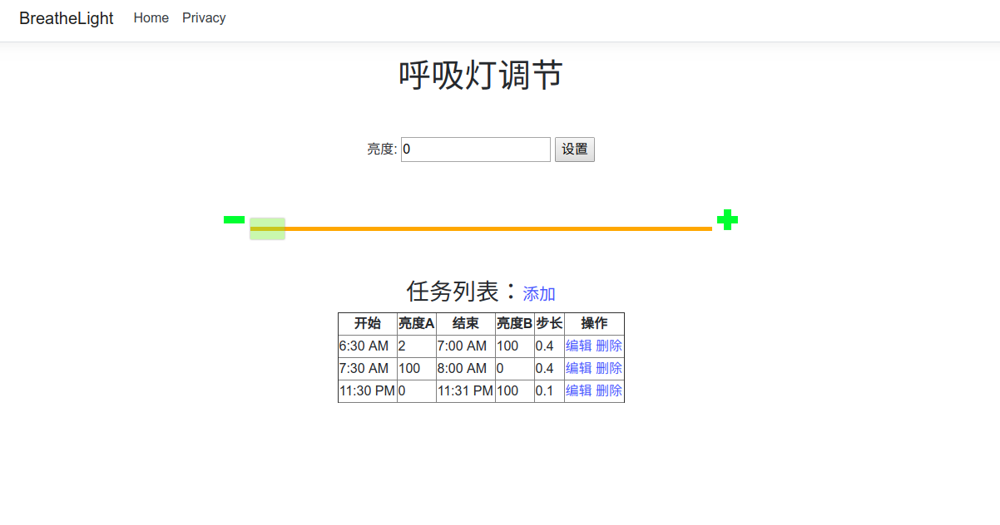

# BreatheLight

这是一个能在Up Board上驱动pwm波的web小程序，用来控制pwm波的占空比，以此来实现控制灯的亮度。

理论上支持UP Board、UP Squared、UP Core以及UP Core Plus。

更多有关于Up Board的开发信息请访问[UpWiki](https://wiki.up-community.org/Main_Page)。

## 入门

简单使用：

1. 安装[.NET Core SDK](https://dotnet.microsoft.com/download)
2. 修改Pwm波需要root权限，所以请在root下运行该项目:`sudo -i`,输入密码。
3. 进入项目目录: `cd ./src/BreatheLight/`。
4. 在配置文件中有Up Board对应的pwm发生端口配置和pwm波特率配置，应将其修改为您的对应配置。
5. 运行：`dotnet run`。

如需使用发布版本：

1. 运行脚本：`./publish.sh`。
2. 切换到root用户后切换到发布目录`light`(否则无法加载正确配置)，直接运行发布的二进制文件`./BreatheLight`